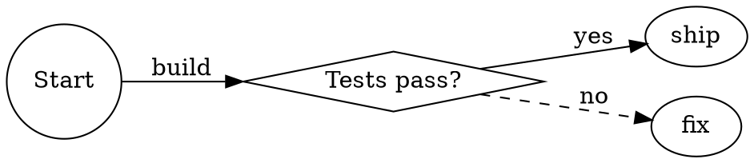
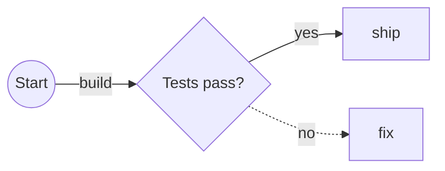
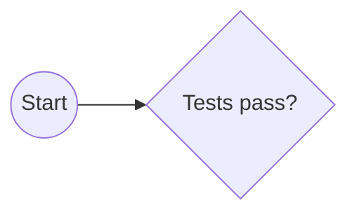

## About this tool

Graphviz DOT and Mermaid flowcharts solve the same problem with different syntax. DOT is common in build tools, dependency analyzers and older architecture docs; Mermaid is what many README files, issue trackers and knowledge bases render natively. This converter rewrites the DOT graph into Mermaid source so you can keep the structure without redrawing the diagram by hand.

Paste a `graph { ... }` or `digraph { ... }` document and the converter parses it locally in WebAssembly. It keeps node IDs, quoted labels, chained edges, graph/node/edge defaults, cluster subgraphs, `rankdir`, selected node shapes, edge labels, dashed/bold/bidirectional links and common color attributes. Features with no Mermaid equivalent are kept as `%%` notes so the output is honest rather than silently lossy.

### Worked example

Input DOT:



Default output:



Turn off **Keep edge labels** when you only want the graph structure, or enable **Wrap in a code fence** to paste the result directly into Markdown:

````markdown

````

### Limits and edge cases

- DOT input is capped at 1 MiB, 2,000 distinct nodes and 5,000 edges so browser conversions stay responsive.
- The converter targets Mermaid `flowchart`, not sequence/class/state diagrams. DOT layout attributes such as `pos`, `splines`, `rank=same`, exact sizes and fonts do not have a direct Mermaid equivalent.
- `rankdir=TB/LR/BT/RL` maps to Mermaid direction; the **Flowchart direction** control can override it.
- Mermaid has fewer node shapes than Graphviz. Common shapes are mapped and unknown ones fall back to rectangles with a `%%` note when warnings are enabled.
- Cluster subgraphs become Mermaid `subgraph ... end` blocks. Non-cluster anonymous grouping is flattened unless it is needed to expand edges.
- DOT ports (`node:port`) are parsed so edges still land on the node, but port-specific attachment points are reported as unsupported because Mermaid flowcharts do not expose them.

## FAQ

<details>
<summary>Can it convert every Graphviz diagram perfectly?</summary>

No. DOT can describe precise renderer layout, fonts, ports, record fields and Graphviz-only shapes that Mermaid flowcharts cannot express. This tool converts the graph structure and the common presentation hints that Mermaid supports, then lists the rest as `%%` comments so you can decide what to adjust manually.

</details>

<details>
<summary>Does it run Graphviz or upload my DOT source?</summary>

No. It uses a small parser compiled to WebAssembly and runs entirely in the browser. That keeps private architecture graphs local, but it also means the tool converts syntax instead of rendering DOT through Graphviz's layout engine.

</details>

<details>
<summary>What happens to labels and special characters?</summary>

Quoted DOT labels are carried into Mermaid labels and escaped for Mermaid's bracket syntax. HTML-like labels are reduced to readable text where possible; advanced table-like HTML labels are not recreated exactly because Mermaid flowcharts do not support Graphviz HTML label tables.

</details>

<details>
<summary>How should I handle a graph that uses clusters?</summary>

Leave **Convert cluster_* subgraphs** enabled. Subgraphs named `cluster_api` or carrying a `label=` become Mermaid subgraphs, including nested clusters. Disable the option if the extra grouping makes the Mermaid source too noisy and you only need the nodes and edges.

</details>

<details>
<summary>Why are my node IDs different in the Mermaid output?</summary>

Mermaid IDs cannot contain every character DOT permits. Unsafe IDs are sanitized, and the original text is preserved as a label when that matters. This keeps the Mermaid parseable while still showing the names from the DOT file.

</details>
