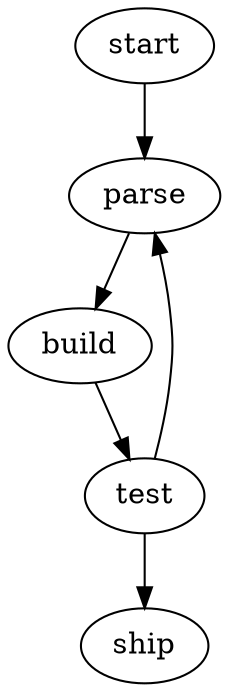

## About this tool

Paste **Graphviz DOT** source and get back a clean, scalable **SVG** — rendered
entirely in your browser with a pure-Rust layout engine, so there's no Graphviz
install and nothing is ever uploaded.

It handles directed graphs (`digraph { a -> b; }`), undirected graphs
(`graph { x -- y; }`), node and edge labels, and chained edges. Turn on
**dark mode** to recolor the diagram with light text, edges and node strokes for
a dark background.

## Example

The result is a standalone `.svg` you can save, embed in a page, or drop into a
document — it stays crisp at any size because it's vector, not a bitmap.

## Privacy

The diagram is laid out and rendered locally in your browser. Your DOT source is
never sent to a server.

## FAQ

Do I need Graphviz installed?

No. The layout and rendering are done by a pure-Rust engine compiled to
WebAssembly, so everything happens in the browser tab — there's no `dot`
binary, no server-side Graphviz, and nothing to install.

How much of the DOT language is supported?

The core that most diagrams use: `digraph { a -> b; }` directed graphs,
`graph { x -- y; }` undirected graphs, node and edge `label` attributes, and
chained edges like `a -> b -> c`. Exotic Graphviz attributes (clusters, ranks,
custom layout engines) aren't part of the pure-Rust engine, so keep the source
to plain nodes, edges and labels. Invalid syntax returns a parse error rather
than a blank image.

What exactly does dark mode change?

Only colors — the layout is identical. Black strokes and label text become a
light grey (`#e6e6e6`) and white node fills become dark (`#1e1e1e`), on a
transparent canvas, so the diagram reads correctly when embedded on a
dark-themed page or slide.

Can I embed the SVG output directly?

Yes — the output is standalone SVG markup. Save it as a `.svg` file, inline it
in HTML, or import it into design tools; because it's vector it stays sharp at
any zoom level, unlike a PNG export.

