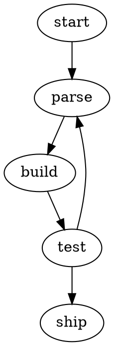

## About this tool

Paste **Graphviz DOT** source and get back a clean, scalable **SVG** — rendered
entirely in your browser with a pure-Rust layout engine, so there's no Graphviz
install and nothing is ever uploaded.

It handles directed graphs (`digraph { a -> b; }`), undirected graphs
(`graph { x -- y; }`), node and edge labels, and chained edges. Turn on
**dark mode** to recolor the diagram with light text, edges and node strokes for
a dark background.

## Example

The result is a standalone `.svg` you can save, embed in a page, or drop into a
document — it stays crisp at any size because it's vector, not a bitmap.

## Privacy

The diagram is laid out and rendered locally in your browser. Your DOT source is
never sent to a server.
