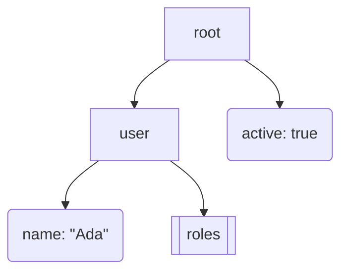

## About this tool

JSON is easy to read at one screenful and painful once objects, arrays and nested API responses start
spanning pages. This tool turns the document structure into diagram source: a Mermaid `flowchart` for
GitHub, GitLab, Notion and Markdown docs, or a Graphviz DOT `digraph` for render pipelines that call
`dot -Tsvg` or `dot -Tpng`.

The graph is structural, not a charting engine. Objects become box nodes, arrays become stacked-box
nodes, scalars become ellipses, and parent/child relationships become edges. By default scalar labels
include values, so this JSON:

```json
{"user":{"name":"Ada","roles":["admin","editor"]},"active":true}
```

produces Mermaid source shaped like:



Use `max_depth`, `max_nodes` and `max_array_items` when a payload is huge. The traversal is
breadth-first, so a node cap preserves the upper levels of the document instead of spending the whole
budget down one long branch.

### Limits and edge cases

- Input must be valid JSON. JSON5 comments, YAML and JavaScript object literals are intentionally not
  accepted.
- `max_nodes` must be at least 1 and is capped at 5,000 by the descriptor; the default is 300.
- `max_depth = 0` and `max_array_items = 0` mean no limit for that specific control.
- Mermaid labels are escaped for diagram safety; quotes appear as numeric entities such as `#34;`.
- DOT labels escape quotes and backslashes for Graphviz quoted strings.
- `include_values = false` is useful before pasting output into docs when scalar values may contain
  sensitive data; keys and structure remain visible.

## FAQ

<details>
<summary>When should I choose Mermaid instead of DOT?</summary>

Choose Mermaid when you want paste-ready source in Markdown, GitHub/GitLab issues, Notion pages or
Mermaid Live. Choose DOT when you already render diagrams with Graphviz or need finer styling in a
separate Graphviz pipeline.

</details>

<details>
<summary>Can this render the diagram image for me?</summary>

No. The tool emits diagram source only. That keeps the block pure, fast and browser-safe while still
producing output that Mermaid or Graphviz can render elsewhere.

</details>

<details>
<summary>How do I keep large arrays readable?</summary>

Set "Max array items per array" to a small number such as 3 or 5. Extra elements collapse into one
ellipsis node like `… 97 more items`, so you can see that the array continues without flooding the
diagram.

</details>

<details>
<summary>Does keys-only mode remove all values?</summary>

Yes for scalar leaf labels. Turn off "Include scalar values" to keep object keys, array positions and
edges while replacing leaf values with just their key names. If "Show type and size hints" is also on,
scalar leaves show their JSON type instead of the value.

</details>
